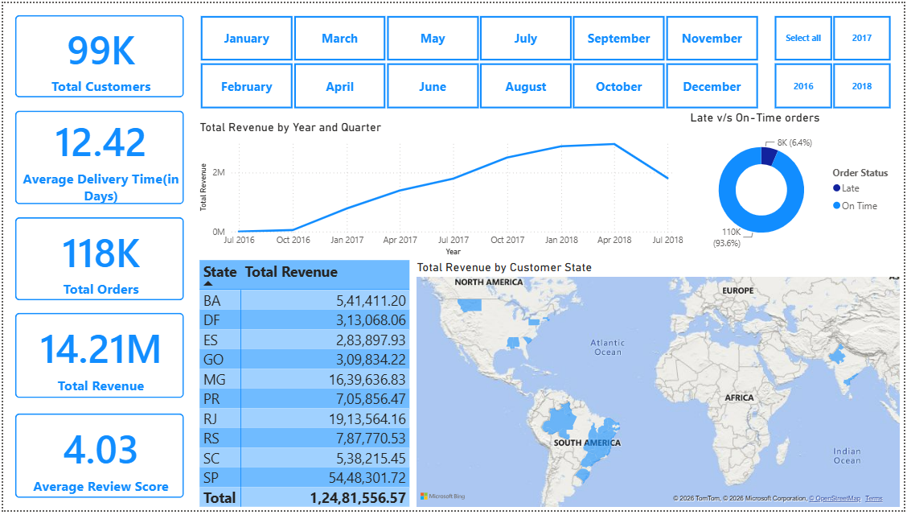
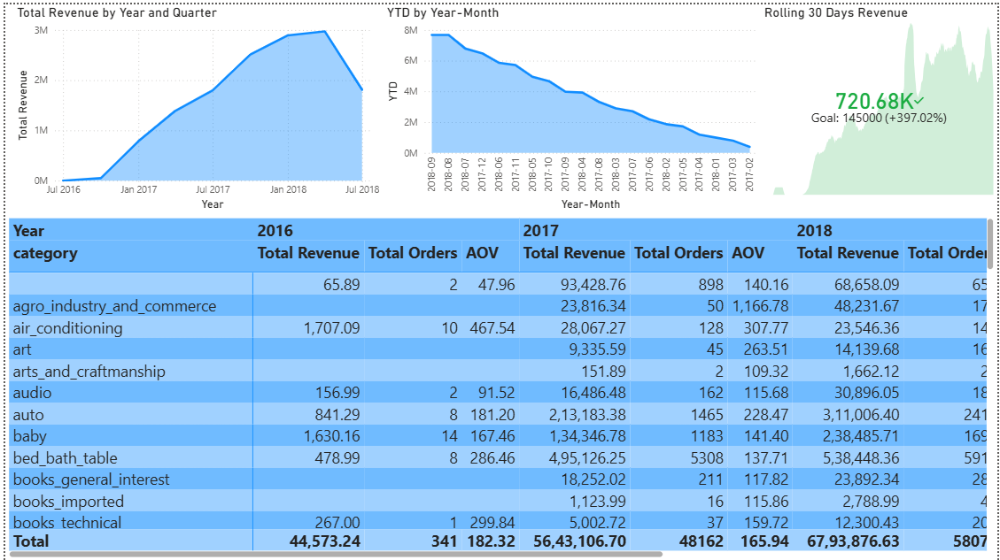
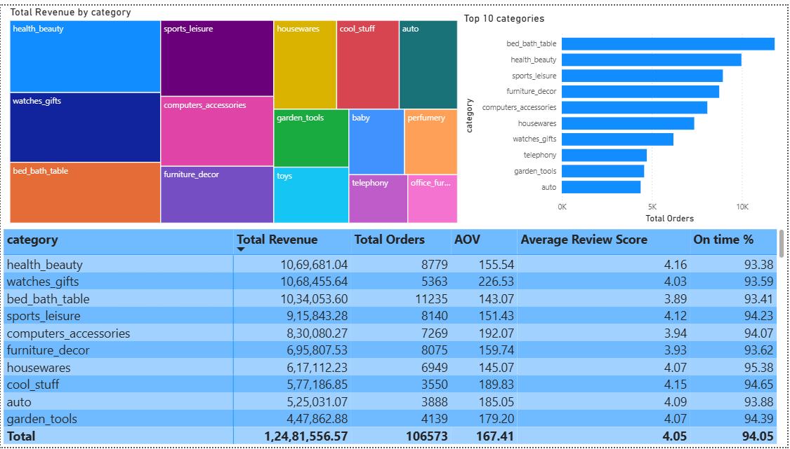
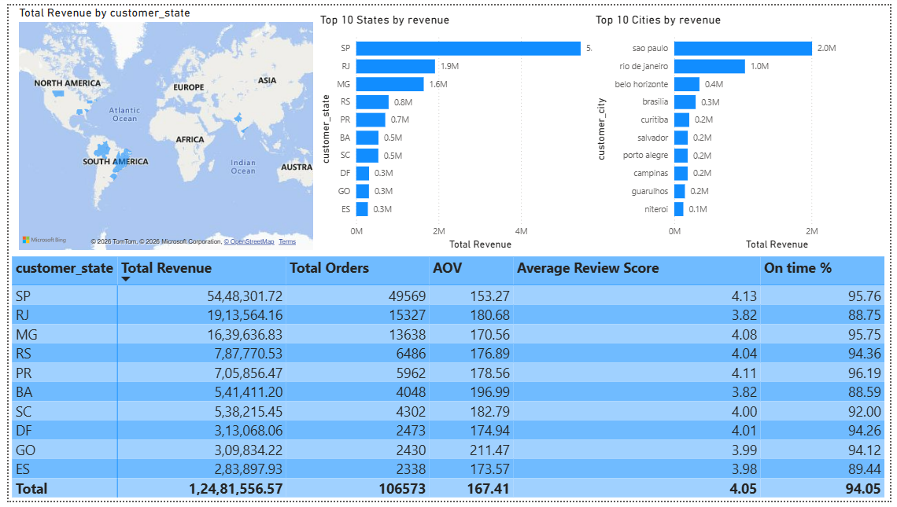
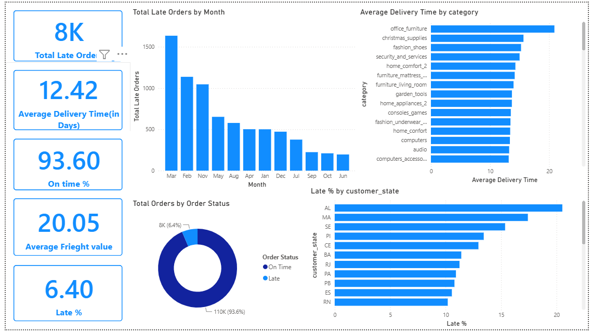
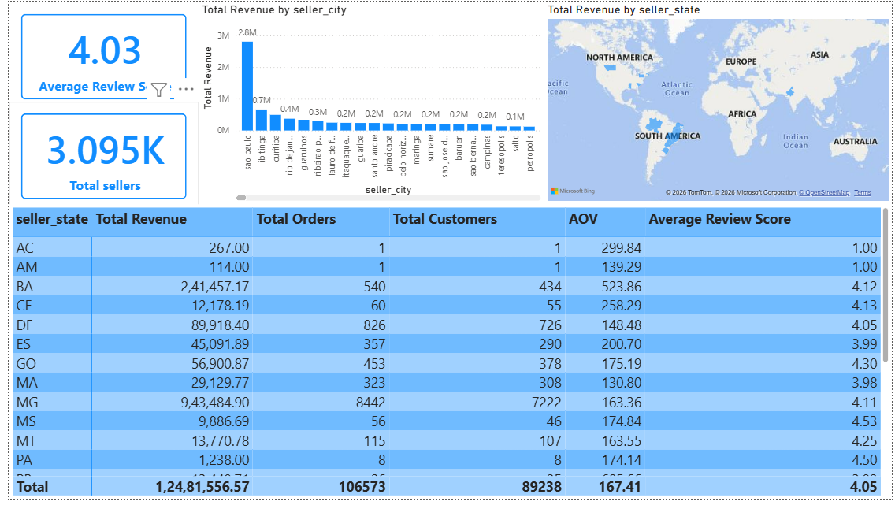

# 📊 Olist E-Commerce Analytics Dashboard

A comprehensive **Power BI dashboard** built using the **Olist Brazilian E-Commerce dataset** to analyze sales performance, customer behavior, product trends, seller insights, and delivery efficiency.

This project demonstrates end-to-end business intelligence workflow including:

- Data extraction and transformation
- SQL-based data modeling
- Data warehousing
- KPI analysis
- Interactive dashboard creation using Power BI

---

# 🚀 Tech Stack

- **Power BI**
- **PostgreSQL**
- **SQL**
- **Power Query**
- **DAX**

---

# 📂 Data Architecture

The project uses **PostgreSQL** as the primary datastore.

### Workflow:

```
Raw Olist CSV Files
        ↓
    PostgreSQL
        ↓
 Data Cleaning & Transformation
        ↓
 Single Analytical View Creation
        ↓
      Power BI
        ↓
 Interactive Dashboard
```

A **single consolidated SQL view table** was created in PostgreSQL by joining multiple Olist tables, allowing optimized reporting and simplified Power BI modeling.

---

# 📊 Dashboard Structure

## 1. Executive Overview

Provides a high-level overview of business performance.

### KPIs
- Total Revenue
- Total Orders
- Total Customers
- Average Delivery Time
- Average Review Score
- On-Time Delivery %

### Visualizations
- Revenue Trend Analysis
- Revenue by State
- Customer State Distribution Map
- Delivery Performance
- Year and Month Filters

---

## 2. Sales Trends

Analyzes sales performance over time.

### KPIs
- Revenue Growth
- Year-to-Date Revenue
- Rolling 30-Day Revenue
- Average Order Value

### Visualizations
- Revenue by Year and Quarter
- YTD Revenue Trend
- Rolling Revenue Analysis
- Category Performance Matrix

---

## 3. Category & Product Analysis

Analyzes category-level business performance.

### Visualizations
- Revenue Treemap
- Top Categories by Orders
- Category Performance Table

### Metrics
- Total Revenue
- Total Orders
- Average Order Value
- Average Review Score
- On-Time Delivery %

---

## 4. Customer Analysis

Analyzes customer purchasing patterns and geographic distribution.

### Visualizations
- Customer State Map
- Top States by Revenue
- Top Cities by Revenue
- Customer Performance Matrix

### Metrics
- Revenue
- Orders
- Average Order Value
- Review Score
- Delivery Performance

---

## 5. Delivery & Logistics

Analyzes logistics efficiency and delivery performance.

### KPIs
- Total Late Orders
- Average Delivery Time
- On-Time Delivery %
- Average Freight Value
- Late Order %

### Visualizations
- Total Late Orders by Month
- Average Delivery Time by Category
- Late Orders Distribution
- Late Percentage by State

---

## 6. Seller Analysis

Analyzes marketplace seller performance.

### KPIs
- Total Sellers
- Average Review Score

### Visualizations
- Revenue by Seller City
- Revenue by Seller State Map
- Seller Performance Matrix

### Metrics
- Revenue
- Orders
- Customers Served
- Average Order Value
- Review Score

---

# 📈 Key DAX Measures

```DAX
Total Revenue = SUM('public bi_fact_sales'[price])
Total Orders = COUNT('public bi_fact_sales'[order_id])
Total Customers = DISTINCTCOUNT('public bi_fact_sales'[customer_id])
Total Customers = DISTINCTCOUNT('public bi_fact_sales'[seller_id])
Average Order Value = AVERAGE('public bi_fact_sales'[payment_value])
Average Review Score = AVERAGE('public bi_fact_sales'[review_score])
Average Delivery Days = AVERAGE('public bi_fact_sales'[delivery_days])
On time % = (CALCULATE(COUNT('public bi_fact_sales'[is_late]),'public bi_fact_sales'[is_late] = 0)/COUNT('public bi_fact_sales'[is_late]))*100
Late % = (CALCULATE(COUNT('public bi_fact_sales'[is_late]),'public bi_fact_sales'[is_late] = 1)/COUNT('public bi_fact_sales'[is_late]))*100
YTD = 
TOTALYTD(
    [Total Revenue],
    'DimDate'[Date]
)
Rolling 30 Days Revenue = 
CALCULATE(
    [Total Revenue],
    DATESINPERIOD(
        'DimDate'[Date],
        MAX('DimDate'[Date]),
        -30,
        DAY
    )
)
Total Late Orders = CALCULATE(count('public bi_fact_sales'[is_late]),'public bi_fact_sales'[is_late]=1)
Average Frieght value = AVERAGE('public bi_fact_sales'[freight_value])
```

---

# 🔍 Business Insights Generated

- Identified top-performing product categories.
- Analyzed revenue distribution across Brazilian states.
- Evaluated customer purchasing behavior.
- Measured seller performance and market concentration.
- Identified logistics bottlenecks and delayed deliveries.
- Tracked revenue trends using YTD and rolling metrics.
- Evaluated customer satisfaction using review scores.

---

# 🎯 Skills Demonstrated

### Data Engineering
- Data Cleaning
- SQL Joins
- PostgreSQL Views
- Data Modeling

### Business Intelligence
- Dashboard Design
- KPI Development
- Data Visualization
- Interactive Reporting

### Analytics
- DAX Calculations
- Time Intelligence
- Trend Analysis
- Customer Analytics
- Seller Analytics
- Logistics Analytics

---
---

# 📸 Dashboard Screenshots

## Executive Overview



---

## Sales Trends



---

## Category & Product Analysis



---

## Customer Analysis



---


## Delivery & Logistics



---

## Seller Analysis



---

# 🎯 Project Objectives

- Build an end-to-end business intelligence solution
- Practice SQL data modeling
- Create analytical views in PostgreSQL
- Develop advanced Power BI dashboards
- Implement DAX measures and KPIs
- Extract business insights from e-commerce data

---

# 💡 Key Insights Generated

- Identified top-performing product categories
- Analyzed customer purchasing patterns
- Evaluated seller performance
- Measured delivery efficiency
- Tracked revenue growth trends
- Monitored operational KPIs

---

# 👨‍💻 Author

**Yash Mendiratta**

- Full Stack Android Developer
- Aspiring Data Analyst / Data Scientist
- Passionate about Data Analytics, BI, and Software Development
